# Лабораторная работа 1
 
### Задание 1
* Исходный код - текст программы на языке программирования.
* Исполняемый файл (исполняемый код) — файл, содержащий программу в виде набора элементарных инструкций, которая после загрузки в память может быть выполнена на определенном физическом устройстве (процессоре) под управлением опредленной операционной системы.
* Ассемблер — язык программирования низкого уровня, в котором
каждая инструкция физического устройства представлена в текстовом
виде
* Виртуальная машина — это средство описания семантики языка
программирования
* Стандарт языка программирования — документ, описывающий
язык программирования максимально подробно и, по возможности,
наиболее формально.
* Компилятор - транслятор, переводящий программу в машинный код
для последующего исполнения.
* Интерпретатор - транслятор, читающий и исполняющий программу по
одной команде (Lisp).
* Псевдокомпилятор—транслятор, переводящий программу в
промежуточное представление (байт-код), который состоит из набора
инструкций близких по смыслу к машинному коду.
* Компилирующий интрепретатор—транслятор, переводящий
текст программы во внутреннем представление непосредственно после
запуска.
* REPL-интерпретатор - программное средство, работающее в
цикле чтения-вычисления-печати (Read-Eval-Print Loop).
* Единица трансляции—минимальный фрагмент программы,
который может быть транслирован независимо от остального кода.
* Предобработка - выполнение замен в тексте программ по
заданным правилам.
* Препроцессинг (предобработка)—начальный этап трансляции
программы.
* Сборка—заключительный этап трансляции, результатом которого
является исполняемый файл
* make—утилитадляуправленияпроцессомкомпиляцииисборки
программ

### Задание 2

* F4
* F8
* F7
* Alt+F2
* Shift+F2
* Shift+F4
* Ctrl+O
* Shift+F6

### Задание 3

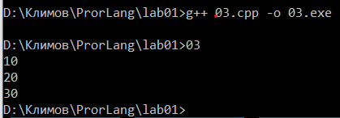 

### Задание 4 

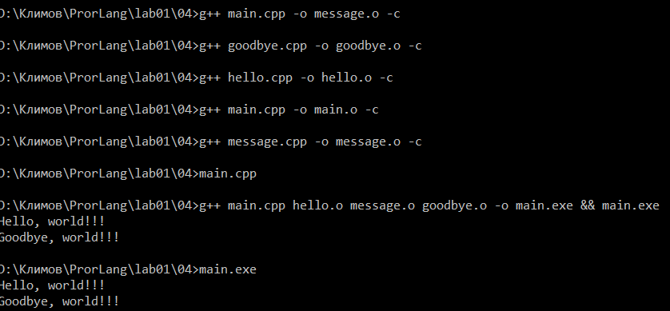

### Задание 5

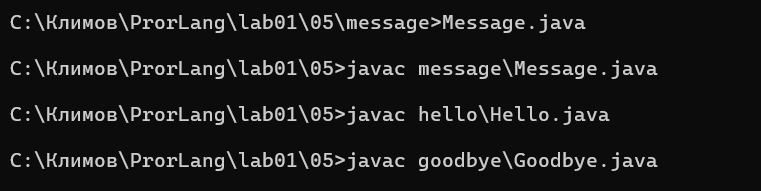

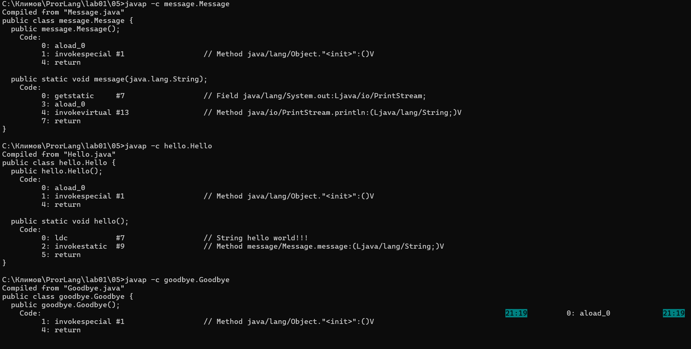

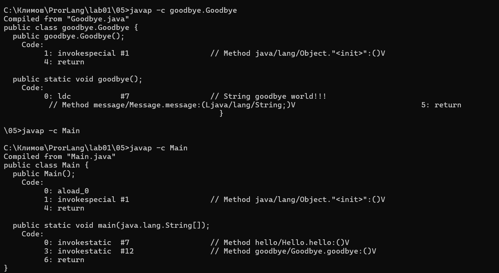

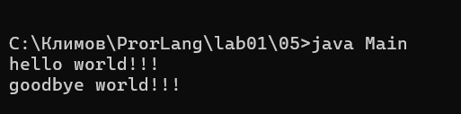

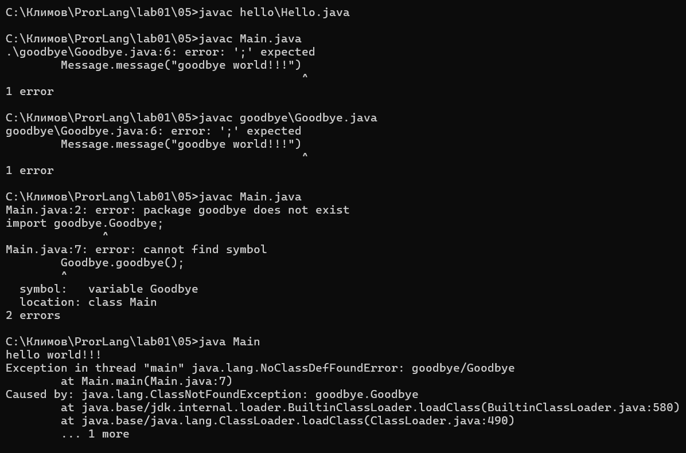
                             
### Задание 6

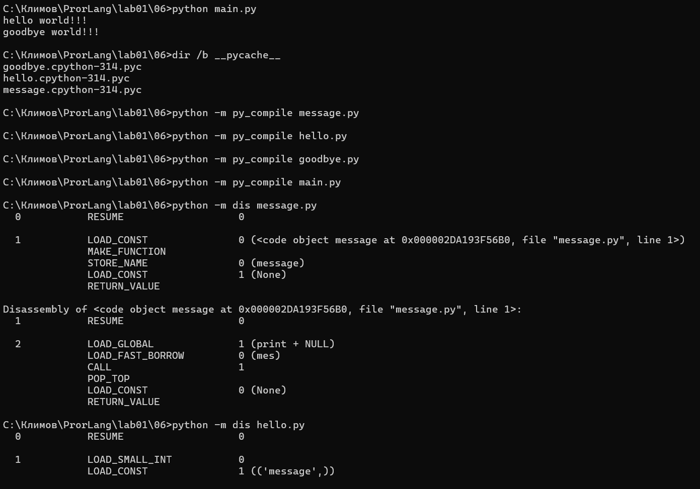
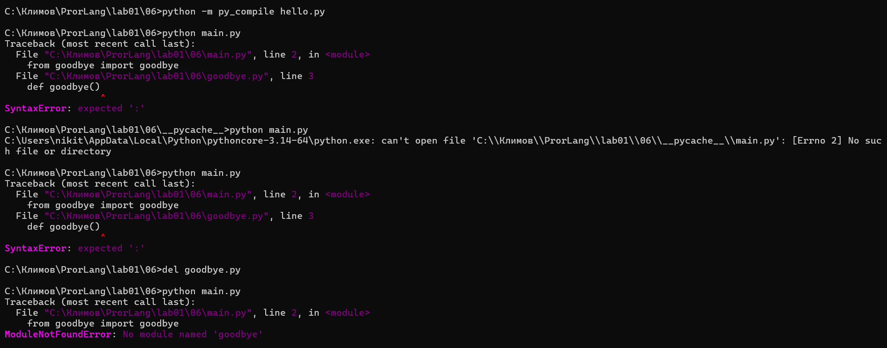

### Задание 7

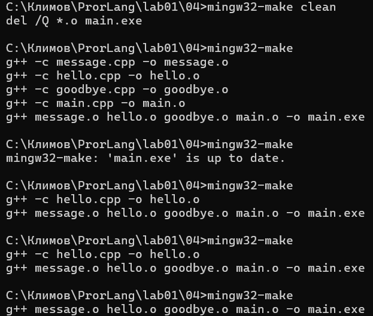

### Задание 8                

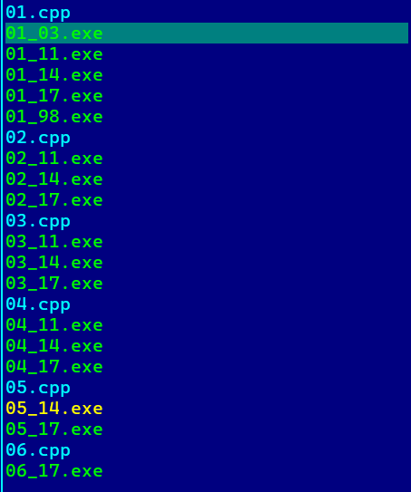

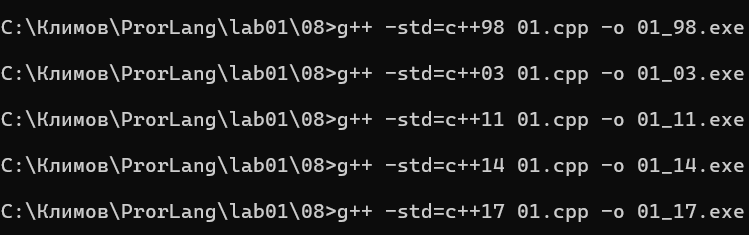

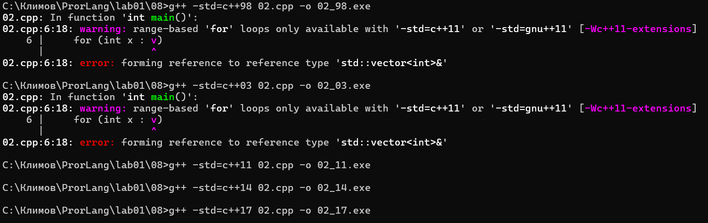

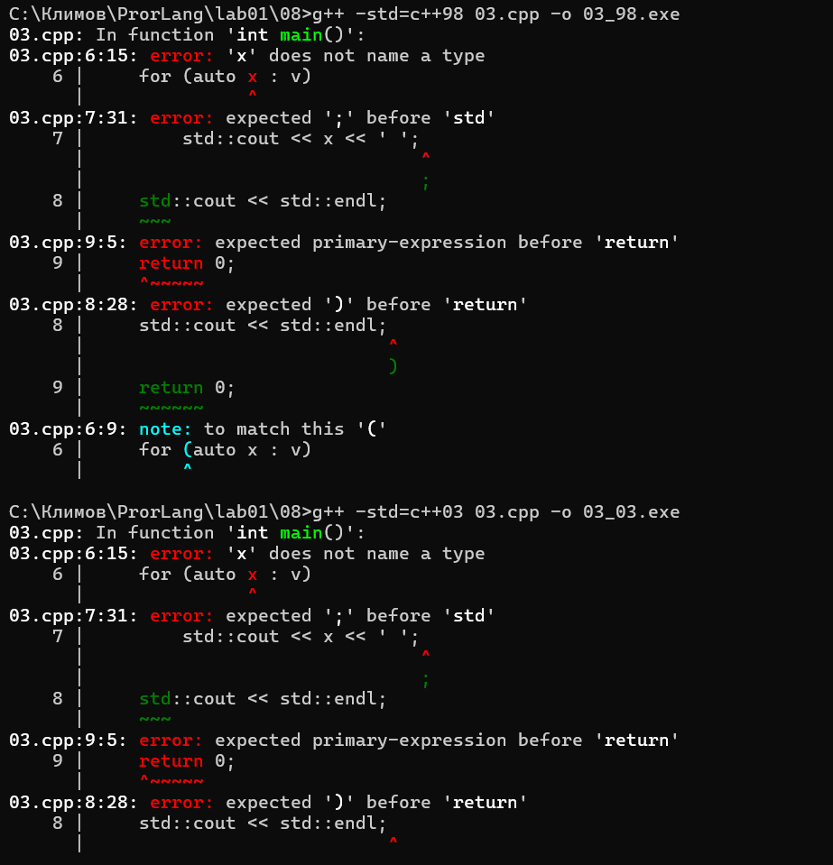

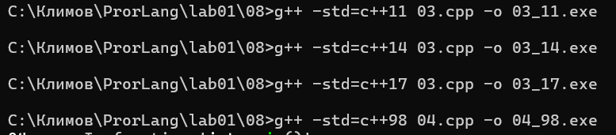

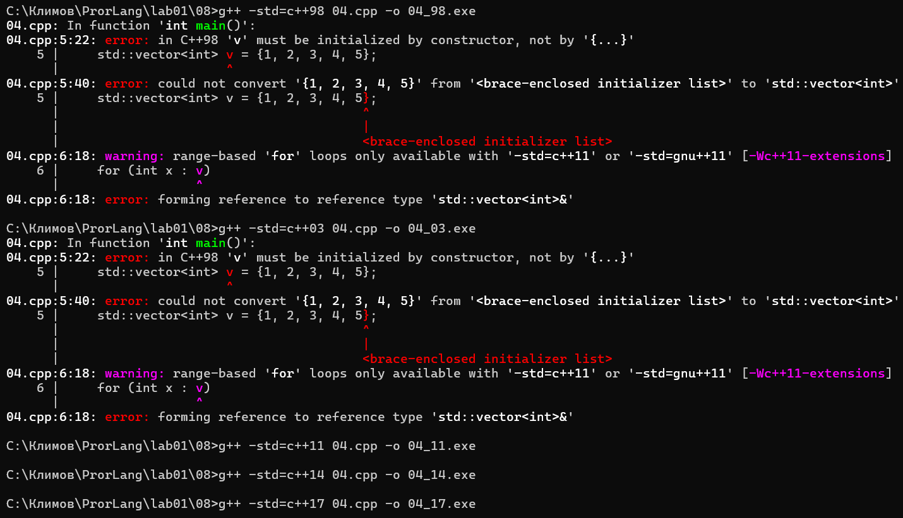

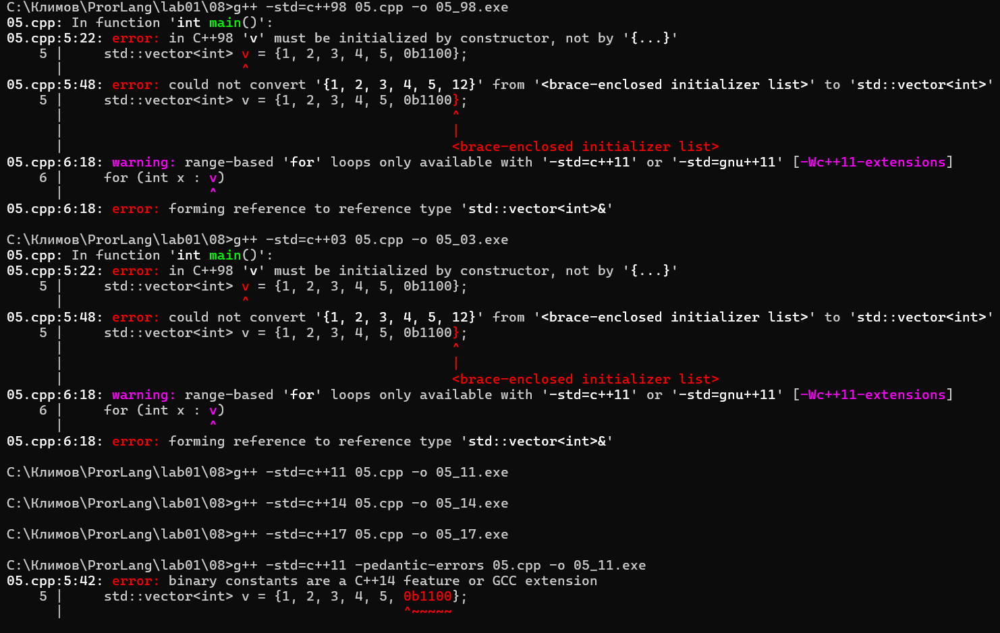

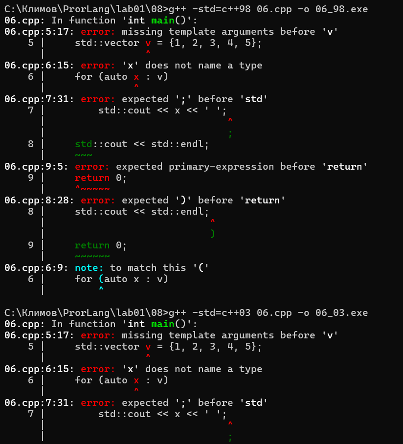

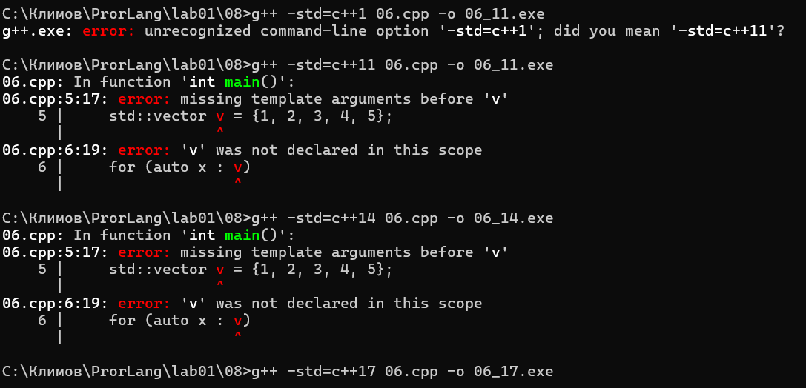

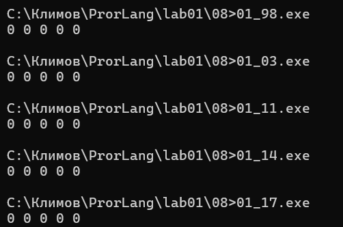

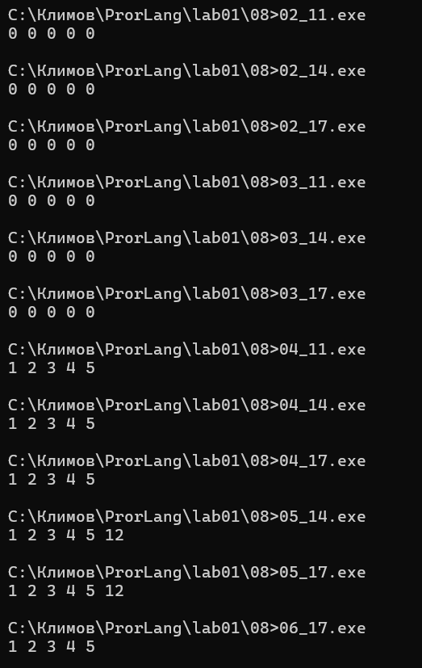
                             
### Задание 9

##### O0
                                                   
		movl	$0, -4(%rbp)                   // s = 0
		leaq	-12(%rbp), %rax
		movq	%rax, %rdx
		movq	.refptr._ZSt3cin(%rip), %rax
		movq	%rax, %rcx
		call	_ZNSirsERi
		movl	$0, -8(%rbp)                   // i = 0
		jmp	.L2
	.L3:
		movl	-12(%rbp), %eax                // eax = x
		addl	%eax, -4(%rbp)                 // s += x
		addl	$1, -8(%rbp)                   // i++
	.L2:
		cmpl	$122, -8(%rbp)                 // i <= 122 
		jle	.L3                            // если да — назад в тело

##### O1

	
		call	_ZNSirsERi                     // cin >> x
		movl	44(%rsp), %edx                 // edx = x
		movl	$123, %eax                     // счётчик = 123
		.p2align 3
	.L2:
		subl	$1, %eax                       // счётчик--
		jne	.L2                            // пока не 0
		imull	$123, %edx, %edx               // edx = x * 123O2

		movl	44(%rsp), %edx           // edx = x
		imull	$123, %edx, %edx         // edx = x * 123

##### О2
          
	call	_ZNSirsERi                        // cin >> x
	imull	$123, 44(%rsp), %edx              // edx = x * 123
	movq	.refptr._ZSt4cout(%rip), %rcx
	call	_ZNSolsEi                         // cout << s