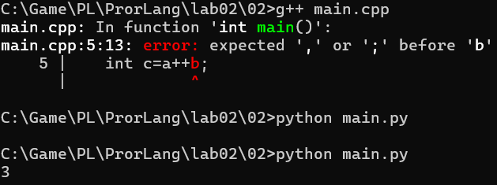

# Языки программирования
## Лабораторная работа 2
### Задание 1 **(2)**
*Запишите по пять любых ключевых слов из синтаксиса каждого из следующих языков: С++, Java, Python.
Проверьте, можно ли создать переменные с именами записанных слов.*

**C++**: `int`, `if`, `else`, `for`, `return`
**Java**: `int`, `if`, `else`, `for`, `return`
**Python**: `def`, `if`, `else`, `for`, `return`

### Задание 2 **(2)** // Записать токены: Последовательность токенов *int *main *( *) *++ - унарный оператор
*Рассмотрим следующие фрагменты программ на языках С++ и Python.*

**C++**
```
int main() {
   int a=1, b=2;
   int c=a++b;
   return 0;  
}
```
```
int     //ключевое слово
main    //идентификатор
(       //пунктуатор
)       //пунктуатор
{       //пунктуатор
int     //идентификатор
a       //идентификатор
=       //оператор 
1       //литерал
,       //разделитель
b       //идентификатор
=       //оператор
2       //литерал
;       //разделитель
int     //ключевое слово
c       //идентификатор
=       //оператор
a       //идентификатор
++      //оператор
b       //идентификатор
;       //разделитель
return  //ключевое слово
0       //литерал
;       //разделитель
```
**Python**
```
a=1
b=2
c=a++b
```
```
а //идентификатор
= //оператор
1 //литерал
NEWLINE //разделитель
b //идентификатор
= //оператор
2 //литерал
NEWLINE // разделитель
с //идентификатор
= //оператор
a //идентификатор
+ //оператор(бинарный)
+ //оператор(унарный)
b //идентификатор
```

*Запишите эти программы и выполните их трансляцию (запуск). Запишите в отчет сообщения об ошибках.*



*Разбейте эти программы на последовательности токенов и объясните, почему программа на C++ содержит синтаксическую ошибку, а программа на Python "--- нет.*

Токенизатор разбивает программу на токены и в C++ он встречает унарный оператор "++", соответственно он понимает 
выражение как a++ b, то есть a += 1 b. И всё ломается из-за индентификтора b который просто существует непонятно как,
непонятно зачем. В случае же питона, токенизатор разбивает вот так a + (+b), в Python компилятор видит один бинарный 
оператор сложения "+" и один унарный оператор "+", который ничего не меняет.

### Задание 3 **(2)**
*Рассмотрим следующую программу на языке С++.*
```
int main() {
   int a=1, b=2;
   int c=a+++b;
   return 0; 
}
```
// Всеми способами вставить пробелы и посмотреть как она будет работать

*Запишите эту программу, выполните ее трансляцию и запустите. Проверьте, чему будут равны значения переменных после исполнения этой программы.
Разбейте эту программу на токены и объясните ее работу.*
a = 2 b = 2 c = 3
```
int
main
(
)
{
int
a 
=
1
,
b
=
2
;
int
c
=
a
++
+
b
return
0
```
*Можно ли изменить разбиение этой программы на токены, вставляя пробелы? Если да, то выполните эти изменения и проверьте работу измененной программы.*
Да,вставляя пробелы можно изменить разбиение программы, итог на скрине ниже.

[скрин](03/03.png)

### Задание 4 **(2)**
*В каком случае круглые и квадратные скобки являются операторами?
Приведите примеры фрагментов программ, в которых круглые скобки являются оператором и примеры 
программ, в которых они оператором не являются.*

Круглые скобки являются операторами когда мы вызываем функции, не являются когда мы используем их в выражениях, например,
(1+3) + 4 или при объявлении функций. Квадратные скобки является оператором когда мы обращаемся к элементам массива или вектора.
Не являются оператором когда мы объявляем массив.

оператор
```
#include <iostream>

int square(int x) {
    return x * x;
}

int main() {
    int result = square(5);   // () — оператор вызова функции
    std::cout << result;
    return 0;
}
```
не оператор 
```
int square(int x) {   // () — просто разделитель списка параметров, не оператор
    return x * x;
}

int main() {
    return 0;
}
```

```
#include <iostream>

int main() {
    int a = 2, b = 3;
    int c = (a + b) * 2;   // () — группировка, меняет порядок вычислений, не оператор
    std::cout << c;
    return 0;
}
```
### Задание 5 **(3)**
*Рассмотрим следующую программу на языке Python.*
```
print(*map(sum,zip(
    *[map(int,input().split()) for i in (1,2,3)]
    )))
```
*Найдите в этой программе ключевые слова, идентификаторы, литералы, операторы.
Какие из идентификаторов задают переменные, а какие - имена функций и методов?
Перечислите все функции, которые вызываются в этом фрагменте кода и их параметры.
Что делает эта программа, и как она приходит к результату?*

// Литерал - константа смысл которой определятся записью 1, 2, 3.
// Операторы - 
// input - функция которая вводит одну строку данных и возвращает эту строку. split - разбивает строку на последовательность слов и делает из неё список строк, на пробелы. [1] [2] [3] отдельаные будет если строка 1 2 3 
// map(int - Преобразует всё в инты. 
//Получится 3 списка интов. В итоге в целом двумерный массив из 3 строк
// zip - будет спискок из картежей по столбцам. Типо транспонирование, а после к этому всему применяется сумма.
// Ввод 
1 2 3 4 5
2 3 4 5 6
3 4 5 6 7

Ключевые слова:
```
for
in
```
Идентификаторы:
```
print//имя функции
map//имя функции
sum//имя функции
zip//имя функции
int//встроенный тип
input//имя функции
split //имя метода
i //переменная
```
Литералы
```
1
2
3
```
операторы
```
*(перед map() в print)
*(перед [] в zip)
.(в input().split())
(
)

```
Разделители
``` 
() когда там 1,2,3
[]
```
Функции
```
input()				//читает одну строку с клавиатуры
.split()                        //разбивает строку на список подстрок по пробелам
map(int, input().split())       //оборачивает конвертацию каждой подстроки в число в объект map
zip(*[])                        //группирует элементы по позициям — транспонирует «строки» в «столбцы»
sum()                           //суммирует числа
map(sum,zip())                  //применяет sum к каждой группе от zip
print(*map())                   //выводит все суммы через пробел
```
Шаг 1. for i in (1,2,3) запускает 3 итерации. На каждой:

input() читает строку с клавиатуры
.split() разбивает её на слова по пробелам
map(int, ...) готовит конвертацию каждого слова в число

Результат шага — список из 3 объектов map, по одному на каждую введённую строку.

Шаг 2. *[...] распаковывает этот список из 3 элементов в 3 отдельных аргумента для zip.

Шаг 3. zip(...) берёт по одному элементу одновременно из каждого из 3 объектов map — получаются кортежи, где i-й кортеж состоит из i-х чисел всех трёх строк. Это транспонирование: из 3 строк получаются столбцы.

Шаг 4. map(sum, zip(...)) суммирует числа в каждом таком кортеже (столбце).

Шаг 5. print(*...) распаковывает и печатает получившиеся суммы через пробел.
                                                                            
### Задание 6 **(2)**
*Как можно записывать комментарии на С++?*

*Какие из приведенных ниже примеров являются синтаксически неверными (вызывают ошибки при трансляции)?
Почему? Как работают синтаксически верные примеры?*
```
cout<<"Hello /* Это комментарий */ world";
```

Внутри строкового литерала (между " и ") символы /* и */
не имеют никакого специального смысла — они воспринимаются как обычные символы текста, часть строки. 
Строковый литерал разбирается токенизатором целиком, от открывающей до закрывающей кавычки, и правила комментариев внутри него не действуют.
```
// /*
 Это комментарий
*/        
```
Синтаксически неверно — вызывает ошибку компиляции.

// делает комментарием только первую строку (/*), до конца строки. Вторая строка Это комментарий — это уже не комментарий, а обычный код:
компилятор пытается разобрать Это, комментарий как токены (идентификаторы) без каких-либо операторов и точки с запятой между ними.
Третья строка */ тоже вызовет ошибку — символы * и / вне контекста комментария или деления не имеют смысла как отдельная инструкция.

```
/* Я комментирую программы /* комментарий */ */
```
Синтаксически неверно — вызывает ошибку компиляции.
Оставшийся фрагмент */ вне комментария — это просто * и /, два отдельных оператора
без операндов и контекста, что вызывает синтаксическую ошибку.
```
// Я комментирую программы /* комментарий */  
```
Синтаксически верно.

// комментирует всё до конца строки целиком. Символы /* и */ внутри однострочного комментария не имеют никакого специального значения — 
они просто часть закомментированного текста, компилятор их вообще не видит. Вся строка полностью игнорируется.
```
/* Я комментирую свои программы
// Это комментарий до конца строки */
*/
```
После закрытия комментария остаётся отдельная строка */ и соответственно это 2 оператора без операндов и контекста.
Способы записи комментов в C++
```
Однострочный комментарий // — всё от // до конца текущей строки игнорируется компилятором.
Многострочный комментарий /* ... */ — всё между /* и первым встреченным */ игнорируется, независимо от количества строк.
```
### Задание 7 **(4)**
*Найдите в стандарте С++*

[http://www.open-std.org/jtc1/sc22/wg21/docs/papers/2017/n4659.pdf]

*в приложении* **A.5** *формальные синтаксические правила для 
инструкций циклов* **iteration-statement.** *Опишите на естественном языке каждую строчку
из этих правил. Для каждой строчки из правила приведите короткий пример фрагмента программы,
которая построена по этому правилу.*

**Формат ответа.**

*Как видно из правил, есть ... (указать число) инструкции циклов.
Первый вид "--- цикл ...(название), который сответсвует строке правила*

*... (переписать строку из правила)*

* Формат записи (по правилу): ключевое слово* **<<while>>**, *в круглых скобках условие* **<<condition>>**,  
*далее инструкция* <<**statement**>>.

*Пример фрагмента программы.*
```
int x = 1;
while (x<1000) {
  cout << x;
  x *= 2;
}
```
*Как видно из правил, есть 4 инструкции циклов.
Первый вид — цикл while, который соответствует строке правила* 

*while ( condition ) statement*

* Формат записи (по правилу): ключевое слово <<**while**>>, в круглых скобках условие <<**condition**>>, далее инструкция <<**statement**>>.

*Пример фрагмента программы.*
```
int x = 1;
while (x<1000) {
  cout << x;
  x *= 2;
}
```

*Второй вид — цикл do-while, который соответствует строке правила
do statement while ( expression ) ;*
                                             
* Формат записи (по правилу): ключевое слово <<**do**>>, инструкция <<**statement**>>, ключевое слово <<**while**>>, в круглых скобках выражение <<**expression**>>, далее точка с запятой.

*Пример фрагмента программы.*
```
int x = 1;
do {
  cout << x;
  x *= 2;
} 
while (x<1000);
```

*Третий вид — цикл for (классический), который соответствует строке правила
for ( for-init-statement condition-opt ; expression-opt ) statement*

* Формат записи (по правилу): ключевое слово <<**for**>>, в круглых скобках инструкция инициализации <<**for-init-statement**>>, необязательное условие <<**condition**>>, 
точка с запятой, необязательное выражение <<**expression**>>, далее инструкция <<**statement**>>.


*Пример фрагмента программы.*
```
int a[10];
for (int i = 0; i < 10; i++) {
  a[i] = i;
}
```

*Четвёртый вид — цикл for по диапазону (range-based for), который соответствует строке правила
for ( for-range-declaration : for-range-initializer ) statement*

* Формат записи (по правилу): ключевое слово <<**for**>>, в круглых скобках объявление переменной цикла <<**for-range-declaration**>>, двоеточие,
инициализатор диапазона <<**for-range-initializer**>>, далее инструкция <<**statement**>>.

Пример фрагмента программы.
```
int array[5] = { 1, 2, 3, 4, 5 };
for (int& x : array)
  x *= 2;
```
### Задание 8 **(3)**
*В следующей программе постройте абстрактное синтаксическое дерево для выражения,
вычисляющего значение переменной* **a**.
```
int main() {
int a,x,y,z;
cin >> x >> y >> z;
a = -x+y*(z-1);
}
```
```
   =
 /   \
a     +
    /   \
-(унар)  *
  /     / \
 x     y   -
          / \
         z   1
```
## Дополнительные задания

### Задание 1 **(20)**

*Возьмите любую программу на С++, содержащую инструкцию цикла for c вложенным ветвлением и 
вычислением нескольких выражений. При этом желательно выбрать программу покороче. Проделайте для нее
все действия как в лекции.*

* Постройте для последовательность токенов. 
* Постройте полное синтаксическое дерево разбора (лучше на бумаге). При этом скопируйте в отдельный 
файл все правила грамматики, используемые при построении дерева.
* Постройте абстрактное синтаксическое дерево программы.
* Выполните трансляцию программы в ассемблер и найдите соответствия между кодом и элементами абстрактного синтаксического дерева.


