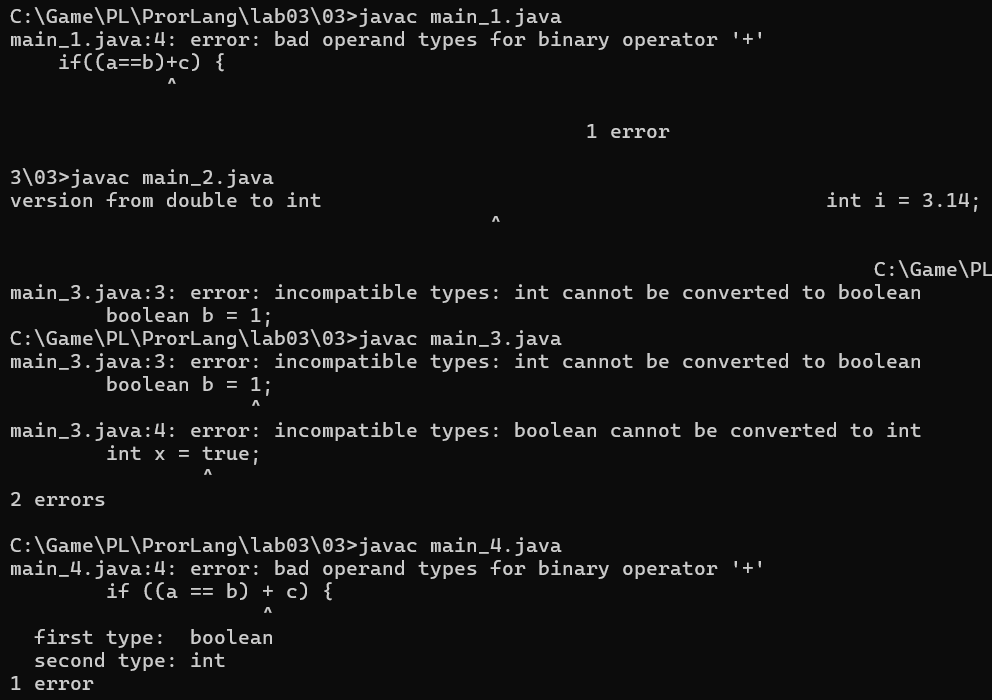
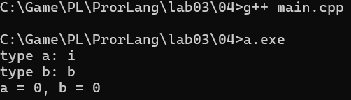
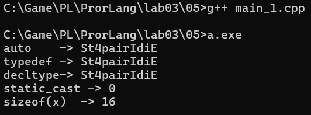
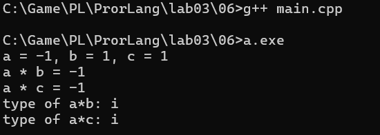
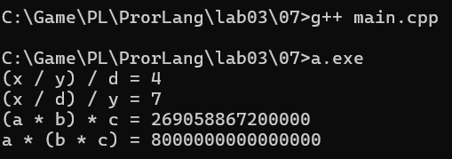
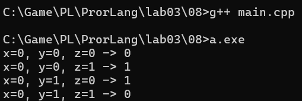

# Языки программирования
## Лабораторная работа 3

### Задание 1 **(3)**
*Составьте глоссарий из определений лекции. Проверка отчета будет включать 
проверку знания определений*
* **Тип в программировании** - атрибут объекта данных, задающий множество допустимых
значений и методы для работы с ними.
* **Статическая типизация** - если
тип объекта данных определяется в момент трансляции.
Литералы—по записи литерала.
Переменные и именованные константы—по объявлению.
Результаты выражений —по оператору и типу операндов
* **Динамическая типизация** - тип объекта данных определяется на этапе выполнения программы в момент создания или присваивания значения.
* **Неявная типизация** - это когда программист не указывает тип переменной явно, а язык определяет его сам из контекста. auto в с++, var в java.
* **Явное преобразование типа** - оно указано в
программе в виде вызова функции или в виде операции.
* **Неявное преобразование типа** - в программе оно никак не указано; его выполняет компилятор (транслятор) или среда выполнения, применяя правила преобразования типов, определённые в стандарте языка.
* **Сильная типизация** - язык программирования не содержит (почти
не содержит) правил неявного преобразования типа.
* **Слабая типизация** - язык программирования содержит большое
число правил неявного преобразования типа, допускает каламбуры
типизации.

### Задание 2 **(3)**
*Запишите правила неявного преобразования типов в языке С++*

*Проверка отчета будет включать проверку знания правил.*

*Преобразования при присваивании*

Правило: что справа — превращается в то, что слева.

```cpp
int x = 3.14;   // 3.14 превращается в int → x = 3
double d = 5;   // 5 превращается в double → d = 5.0
bool b = 0;     // 0 → false
bool b2 = 10;   // 10 → true
```

*Преобразования при арифметических действиях*

Правило: меньший тип подтягивается к большему.

Примерный порядок:

char/short/bool → int → long → long long → float → double → long double

```cpp
5 + 2.5      // 5 станет 5.0, результат 7.5 (double)
'A' + 1      // 'A' станет 65, результат 66 (int)
char a = 10;
char b = 20;
a + b        // результат типа int, а не char
```

Важно: если смешать знаковое и беззнаковое (int и unsigned), знаковое может стать беззнаковым — иногда получается странный результат.

*Преобразования с логическими значениями*

Правило: 0 — это false, всё остальное — true.

```cpp
if (5)        // true
if (0)        // false
if (0.0)      // false
if (nullptr)  // false

bool b = 3.14; // true
```
Обратно:
```cpp
true  → 1
false → 0
```

### Задание 3 **(2)**

*Языки C++ и Java имеют похожий синтаксис, однако
язык С++ относят к языкам со слабой статической типизацией, а Java - с сильной статической типизацией.
Приведите примеры, показывающие это различие. Для этого вам надо подобрать несколько близких по смыслу фрагментов программ,
которые будут транслироваться в С++, но вызывать ошибку согласования типов в Java.*

*Записанные программы сохраните в папке с номером задания. В отчет запишите пояснения к работе программ.*

```c++
#include <iostream>
int main(){
  int a = 2, b = 1, c =1;
  if((a==b)+c) {
    std::cout<<"YES";
  }
  else{
    std::cout<<"NO";
  }
return 0;
}
```

```java
public class Main{
  public static void main(String[] args){
    int a = 2, b = 1, c =1;
    if((a==b)+c) {
      System.out.println("YES");
    }
    else{
      System.out.println("NO");
    }  
  }
}
```

В Java этот код не компилируется, потому что (a == b) имеет тип boolean, а оператор + не применим к boolean и int. В отличие от C++, где bool неявно преобразуется в int (false → 0, true → 1), Java запрещает такое смешивание типов.

```c++
#include <iostream>
int main() {
    int i = 3.14;   // OK в C++: i = 3
    std::cout << "i = " << i << std::endl;
    return 0;
}
```

```java
public class main_2 {
    public static void main(String[] args) {
        int i = 3.14;   
        System.out.println("i = " + i);
    }
}
```

В C++ допускается неявное преобразование double → int при присваивании: компилятор молча отбрасывает дробную часть. В Java такое преобразование считается опасным (возможна потеря данных), поэтому компилятор требует явного приведения (int).

```c++
#include <iostream>
int main() {
    bool b = 1;     // OK: b = true
    int x = true;   // OK: x = 1
    std::cout << "b = " << b << ", x = " << x << std::endl;
    return 0;
}
```

```java
public class main_3 {
    public static void main(String[] args) {
        boolean b = 1;   
	int x = true;    
        System.out.println("b = " + b + ", x = " + x);
    }
}
```
В C++ bool и целые типы взаимозаменяемы: 1 → true, true → 1, 0 → false, false → 0. В Java boolean — самостоятельный тип, не совместимый с числами: ни int → boolean, ни boolean → int не допускаются.



### Задание 4 **(1)**

*Рассмотрите следующий фрагмент программы.*

```
bool x = true, y = false;
auto a = x & y;
std::cout << typeid(a).name() << std::endl;
auto b = x && y;
std::cout << typeid(b).name() << std::endl;
```
*Используя* **typeid**, *найдите типы переменных* **a** и **b**. *Объясните результат.*

#include <iostream>
#include <typeinfo>

```c++
int main() {
    bool x = true, y = false;

    auto a = x & y;
    std::cout << "type a: " << typeid(a).name() << std::endl;

    auto b = x && y;
    std::cout << "type b: " << typeid(b).name() << std::endl;

    std::cout << "a = " << a << ", b = " << b << std::endl;
    return 0;
}
```



bool продвигается до int: true → 1, false → 0.

1 & 0 по битам → 0.

Результат — int со значением 0.

во втором случае просто логическое поэтом b

когда мы просто принтуем то это условность языка, false = 0, true = 1

*Записанную программу сохраните в папке с номером задания.*

### Задание 5. **(2)**

*Приведите разумные (логичные) примеры использования в 
С++ ключевых слов* **typedef, auto, decltype, static_cast** и оператора **sizeof**.

```c++
#include <iostream>
#include <typeinfo>
#include <utility>

typedef std::pair<double, int> mypair;   // псевдоним типа

int main() {
mypair x = {0.5, 2};

// 1) auto — тип выводится из инициализатора
auto y = x;                          // y имеет тип mypair
std::cout << "auto    -> " << typeid(y).name() << std::endl;

// 2) typedef — используем псевдоним для объявления
mypair z;                            // z имеет тип mypair
std::cout << "typedef -> " << typeid(z).name() << std::endl;

// 3) decltype — тип берётся из выражения
decltype(x) u;                       // u имеет тип mypair
std::cout << "decltype-> " << typeid(u).name() << std::endl;

// 4) static_cast — явное преобразование
std::cout << "static_cast -> "
            << static_cast<int>(x.first) << std::endl;  // 0.5 -> 0

// 5) sizeof — размер объекта
std::cout << "sizeof(x)  -> " << sizeof(x) << std::endl;  // 16

return 0;
}
```

*Записанные программы сохраните в папке с номером задания. В отчет запишите пояснения к программам*.

### Задание 6 **(2)**

Рассмотрите следующий фрагмент программы. 
```
int a = -1, b = 1;
unsigned int c = 1;
std::cout << a*b << std::endl;//нет преобразования типов
std::cout << a*c << std::endl;//знаковое преобразуется в беззнаковое если длина одинаковая то есть a станет беззнаковым числом.
```

* *Объясните работу этой программы, используя правила неявного преобразования типов*

int * unsigned int: по правилам обычных арифметических преобразований оба операнда приводятся к unsigned int. -1 превращается в 4294967295, результат — 4294967295.

* *Что произойдет, если тип* **int** *заменить на* **short**, а **unsigned int** на **unsigned short**?*

```
short a = -1, b = 1;
unsigned short c = 1;
std::cout << a*b << std::endl;   // -1
std::cout << a*c << std::endl;   // -1  
```
```c++
#include <iostream>

int main() {
    short a = -1, b = 1;
    unsigned short c = 1;

    std::cout << "a = " << a << ", b = " << b << ", c = " << c << std::endl;

    std::cout << "a * b = " << a * b << std::endl;   // -1
    std::cout << "a * c = " << a * c << std::endl;   // -1

    std::cout << "type of a*b: " << typeid(a * b).name() << std::endl;
    std::cout << "type of a*c: " << typeid(a * c).name() << std::endl;

    return 0;
}
```

Целочисленные типы меньше int (bool, char, short) перед арифметикой всегда продвигаются до int, если int может представить все их значения.

unsigned short (0…65535) => int, а не unsigned int.

unsigned int (0…4294967295) => не вмещается в int, поэтому при смешивании с int оба приводятся к unsigned int.

### Задание 7 **(2)**
*Рассмотрите следующий фрагмент программы.*
```
int x = 7, y = 4;
long double d = 0.25;
cout << (x / y) / d << endl;//преобразование типов и будет вещественно 4.0
cout << (x / d) / y << endl;//будет 28.0 потом 7.0
long a = 200000, b = 200000;//тоже самое что int
long long c = 200000;
std::cout << (a * b) * c << std::endl;//будет непонятное число а*b будет переполнение типа и всё, но чото выведет мб, надо чекать
std::cout << a * (b * c) << std::endl;//будет нормальный ответ
```
*Почему изменения порядка действий приводит
к изменению результата? Объясните работу этой программы, используя правила неявного преобразования типов*

(x/y)/d: сначала целочисленное деление 7/4 = 1, потом приведение к long double → 1/0.25 = 4. Дробная часть потеряна до вещественной арифметики.

(x/d)/y: x сразу приводится к long double → 7/0.25 = 28 → 28/4 = 7. Потери нет.

(a*b)*c: тип a*b — long. На Windows (32-битный long) произведение 200000·200000 переполняет long, дальнейшее продвижение до long long уже не спасает. На Linux (64-битный long) переполнения нет, и результат совпадает с правильным.

a*(b*c): b*c вычисляется в long long (64 бита), переполнения нет → правильный результат.

Вывод: порядок операций влияет на тип промежуточного результата. Если этот тип слишком узкий — переполнение происходит до того, как значение попадёт в более широкий тип, и результат искажается. Правила неявных преобразований применяются к каждому подвыражению отдельно, а не ко всему выражению целиком.



### Задание 8 **(2)**

*Для каких значений целочисленных переменных* **x**, **y** ,**z** *результатом
вычисления следующего выражения будет истина? Перечислите* **все** *случаи.
Объясните работу этой программы, используя правила неявного преобразования типов*

В функции check выражение (x == y) + (x == z) == true вычисляется в несколько шагов. Сначала x == y и x == z дают значения типа bool. Затем в операции + оба bool неявно продвигаются до int (false → 0, true → 1), и сумма имеет тип int со значениями 0, 1 или 2. Наконец, при сравнении с true операнд true тоже продвигается до int и становится 1 — фактически проверяется условие сумма == 1. Таким образом, выражение истинно тогда и только тогда, когда x совпадает ровно с одним из чисел y или z. Именно правила неявного преобразования (bool → int) позволяют складывать результаты сравнений и сравнивать их с true.

```
(x == y) + (x == z) == true
```

*Записанные программы сохраните в папке с номером задания.*

```c++
#include <iostream>

bool check(int x, int y, int z) {
    return (x == y) + (x == z) == true;
}

int main() {                                                   
    std::cout << "x=0, y=0, z=0 -> " << check(0, 0, 0) << "\n";
    std::cout << "x=0, y=0, z=1 -> " << check(0, 0, 1) << "\n";
    std::cout << "x=0, y=1, z=0 -> " << check(0, 1, 0) << "\n";
    std::cout << "x=0, y=1, z=1 -> " << check(0, 1, 1) << "\n"; 
    return 0;
}
```


### Задание 9 **(2)**

*Проверьте работу логического выражения*
```
x==y==z
```
*в языках* **Python**, **Java**, **C++** *для
целочисленных переменных* **x**, **y**, **z**.
*Объясните результат для каждого из языков.*

*Записанную программу сохраните в папке с номером задания.*

```py
# Python: x == y == z работает как цепочка сравнений
# (x == y) and (y == z)

x = 5
y = 5
z = 5

print("x =", x, ", y =", y, ", z =", z)
print("x == y == z ->", x == y == z)   # True
   
x, y, z = 5, 5, 3
print("x=5, y=5, z=3 ->", x == y == z)   # False (y != z)

x, y, z = 5, 3, 5
print("x=5, y=3, z=5 ->", x == y == z)   # False (x != y)

x, y, z = 1, 2, 3
print("x=1, y=2, z=3 ->", x == y == z)   # False (x != y)
```

```java
// Java: x == y == z НЕ КОМПИЛИРУЕТСЯ
// (x == y) даёт boolean, который нельзя сравнить с int

public class Task {
    public static void main(String[] args) {
        int x = 5, y = 5, z = 5;

        // Эта строка вызовет ошибку компиляции:
        // boolean result = (x == y == z);

        // Правильный вариант — через &&:
        boolean result = (x == y) && (y == z);

        System.out.println("x = " + x + ", y = " + y + ", z = " + z);
        System.out.println("x == y == z -> " + result);
    }
}
```

```c++
    // C++: x == y == z разбирается как (x == y) == z
    // (x == y) даёт bool, который неявно приводится к int:
    //   true -> 1, false -> 0
    // Затем 1 (или 0) сравнивается с z.

#include <iostream>

int main() {
    std::cout << std::boolalpha;

    int x = 5, y = 5, z = 5;

    std::cout << "x = " << x << ", y = " << y << ", z = " << z << "\n";

    bool result = (x == y == z);
    std::cout << "(x == y == z) -> " << result << "\n";   // false!

    // Правильный вариант:
    bool correct = (x == y) && (y == z);
    std::cout << "(x == y) && (y == z) -> " << correct << "\n";  // true

    std::cout << "\n--- другие случаи ---\n";

    // Случай, где случайно совпадает:
    int a = 1, b = 1, c = 1;
    std::cout << "x=1, y=1, z=1 -> (x==y==z) = "
              << (a == b == c) << "\n";    // true (1 == 1)

    int a2 = 0, b2 = 0, c2 = 0;
    std::cout << "x=0, y=0, z=0 -> (x==y==z) = "
              << (a2 == b2 == c2) << "\n"; // true (0 == 0)

    int a3 = 5, b3 = 5, c3 = 3;
    std::cout << "x=5, y=5, z=3 -> (x==y==z) = "
              << (a3 == b3 == c3) << "\n"; // false (1 == 3)

    return 0;
}
```

### Задание 10 **(1))**

*Напишите программу на* **Python** *, демонстрирующую возможность неявного преобразования
строки в логическое значение.*

```py
s1 = ""
s2 = "hello"

if s1:
    print('s1 = ""       -> True')
else:
    print('s1 = ""       -> False')

if s2:
    print('s2 = "hello"  -> True')
else:
    print('s2 = "hello"  -> False')
```

В Python строки неявно преобразуются в bool: пустая строка "" становится False, любая непустая — True. Это видно при передаче строки в bool(), в условиях if/while и в логических операциях. Важно, что «ложной» считается только пустая строка — строки "0", "False", " " дают True

*Записанную программу сохраните в папке с номером задания.*

